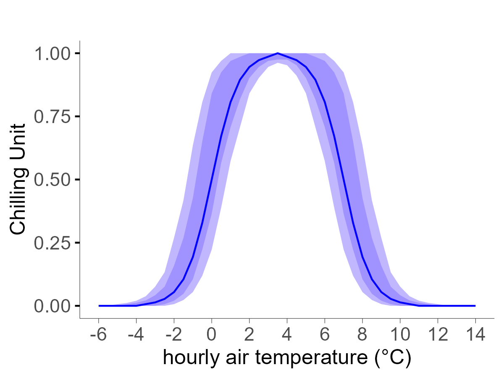

# SWELL - Simulated Waves of Energy, Light and Life

## Table of Contents

- [Introduction](#introduction)
- [Model Description](#model-description)
  - [Dormancy Season](#dormancy-season)
    1. [Dormancy induction](#dormancy-induction)
    2. [Endodormancy](#endodormancy)
    3. [Ecodormancy](#ecodormancy)
  - [Growing Season](#growing-season)
    1. [Growth](#growth)
    2. [Greendown](#greendown)
    3. [Decline](#decline)
  - [NDVI Simulation](#ndvi-simulation)
- [Getting Started](#getting-started)
  - [Design the Simulation](#design-the-simulation)
    1. [NDVI Data](#ndvi-data)
    2. [Weather Data](#weather-data)
    3. [Tree Photothermal Requirements](#tree-photothermal-requirements)
  - [Run swell](#run-swell)
    1. [Calibration Mode](#calibration-mode)
    2. [Validation Mode](#validation-mode)
- [Use Cases](#use-cases)
  - [Beech (_Fagus sylvatica_ L.) Forests in EU](#beech-fagus-sylvatica-l-forests-in-eu)
    1. [Pixel-level Dynamics](#pixel-level-dynamics)
    2. [Ecoregion-level Dynamics](#ecoregion-level-dynamics)
    3. [Inspect Model Parameters](#inspect-model-parameters)
- [Installation](#installation)
- [Support](#support)
- [Contributing](#contributing)
- [License](#license)

## Introduction
SWELL is a process-based based model simulating the daily NDVI dynamic of a remote sensing pixel in a deciduous forested area using photoperiod and temperature as cues and tree photothermal requirements as parameters. 

<figure>

  
  

   <figcaption align="center"><em>Schematic representation of the daily NDVI dynamic simulated by SWELL</em></figcaption>
</figure>

The modeling core reproduces plant phenology composed of dormancy and growing seasons: after being induced, the dormancy season unfolds through endo and ecodormancy, which completes at bud break. Deciduous trees have no leaves in this season. Therefore, pixel-level NDVI dynamics refer to the understory and are simulated as dependent on thermal cues. After ecodormancy completion, temperature and photoperiod are used as input to phenophase-specific functions to reproduce a steep NDVI growth until the peak of the season (growth phenophase), a slight NDVI decrease until a downturn point (greendown phenophase), followed by a sharp NDVI decline due to leaves senescence and fall (decline phenophase), while dormancy is induced again.

You can calibrate swell to reproduce the NDVI of a generic tree species in a forested area. To do this, make sure to prepare:
- the file [pixelsCalibration.csv](https://gitlab.com/simone.bregaglio/swell/-/blob/main/swell_model/files/parameters/pixelsCalibrationParameters.csv) containing the reference NDVI data. [Description]() 
- the file [pixelsCalibrationParameters.csv](https://gitlab.com/simone.bregaglio/swell/-/blob/main/swell_model/files/parameters/pixelsCalibrationParameters.csv) containing the physiological parameters for the tree species and the settings for swell calibration [Description]() 
- the daily input weather files containing geographical information and air maximum and minimum temperature [Description]()

The [Getting started](#getting-started) section provides a detailed description of these resources, and the 

## Model description

Mathematical functions specific to the different phenophases are used to reproduce the effect of temperature and photoperiod on tree phenology. 

<figure>

  
  

  <figcaption align="center"><em>Functions used to simulate the effect of photoperiod and temperature on plant phenological phases</em></figcaption>
</figure>

Every day and during phenophase _x_, a photothermal unit _PTUx_, (day-1, eq. 1) is computed, summed, and divided by the phenophase photothermal requirements _PTRx_ (days, eq. 2) to derive its percentage of completion _PCx_ (%). 

$$PTU_x = PU_x \times TU_x \tag{1}$$
$$PC_x = \frac{\sum_{1}^{n} PTU_x}{PTR_x} \times 100\tag{2}$$

where _PUx_ (0-1, day-1) and _TUx_ (0-1, day-1) are the photoperiodic and thermal components of _PTUx_, respectively, and _n_ is the number of days elapsed from the start of the _x_ phenophase. 

### Dormancy season
The [Dormancy induction](#dormancy-induction) is stimulated by short and cold days. Once induced, the dormancy season unfolds through [Endodormancy](#endodormancy), when chilling accumulation occurs, and [Ecodormancy](#ecodormancy), whose progress is promoted by longer days and warm temperatures.

#### Dormancy induction
The following equations (3 and 4) are used to draw the logistic function displayed in the figure below, which is used to estimate the photoperiodic unit for dormancy induction _PUDI_.

$$
P_{\text{DI\_mid}} = 0.5 \cdot (P_{\text{DI\_l}} + P_{\text{DI\_nl}}) \tag{3}
$$

$$
PU_{\text{DI}} = \begin{cases}
  0 & \text{if } D_l \geq P_{\text{DI\_l}} \\
  1 & \text{if } D_l \leq P_{\text{DI\_nl}} \\
  \frac{1}{1 + e^{10/(P_{\text{DI\_l}} - P_{\text{DI\_nl}}) \cdot (D_l - P_{\text{DI\_mid}})}} & \text{elsewhere}
\end{cases} \tag{4}
$$

where _PDI\_mid_ (hours) is the midpoint of the logistic function increasing from _PDI\_l_ (hours) to _PDI\_nl_ (hours), i.e., the limiting and non-limiting day length for dormancy induction, respectively; _Dl_ (hours) is the day length.

<figure>

  
  

  <figcaption align="center"><em>Photoperiodic unit for dormancy induction. The shades correspond to the 40-60th and 25-75th percentiles of the distribution generated with limiting photoperiod ranging from 12 to 14.5 hours and non limiting photoperiod from 11.5 to 13 hours.</em></figcaption>
</figure>

The thermal unit for dormancy induction are derived with another logistic function, using equations 5 and 6.

$$
T_{\text{DI\_mid}} = 0.5 \cdot (T_{\text{DI\_l}} + T_{\text{DI\_nl}}) \tag{5}
$$

$$
TU_{\text{DI}} =
\begin{cases}
0 & \text{if } T \geq T_{\text{DI\_l}} \\
1 & \text{if } T_{\mathrm{l}} \leq T_{\text{DI\_nl}} \\
\frac{1}{1 + e^{10/(T_{\mathrm{DI\_l}} - T_{\mathrm{DI\_nl}}) \cdot (T - T_{\mathrm{DI\_mid}})}} & \text{elsewhere}
\end{cases}
\tag{6}
$$

where _TDI\_mid_ (°C) is the midpoint of the logistic function increasing from _TDI\_l_ (°C) to _TDI\_nl_ (°C), i.e., the limiting and non-limiting temperature for dormancy induction, respectively; _T_ (°C) is the average daily air temperature.

<figure>

  
  

   <figcaption align="center"><em>Thermal units for dormancy induction. The shades correspond to the 40-60th and 25-75th percentiles of the distribution generated with limiting temperature ranging from 17 to 22 °C and non limiting temperatre from 3 to 8 °C.</em></figcaption>
</figure>

Each day, _PUDI_ and _TUDI_ are multiplied to give the daily photothermal unit of dormancy induction _PTUDI_ and the respective completion percentage _PCDI_

#### Endodormancy
After dormancy induction is completed, the endodormancy proceeds along with chilling units’ accumulation, computed according to the following equations 7 and 8. The chilling units are computed hourly, therefore the daily dynamic of air temperature is simulated from daily maximum and minimum air temperature. For more details, you can refer to [Soil Physics with BASIC](https://shop.elsevier.com/books/soil-physics-with-basic/campbell/978-0-444-42557-7).

$$
CU_{\text{mid}} = 
\begin{cases}
  0.5 \cdot (T_{\mathrm{EN\_l}\downarrow} + T_{\mathrm{EN\_nl}\downarrow}) & \text{if } T_h \leq T_{\mathrm{EN\_nl}\downarrow} \leq T_{\mathrm{EN\_l}\downarrow}, \\
  0.5 \cdot (T_{\mathrm{EN\_l}\uparrow} + T_{\mathrm{EN\_nl}\uparrow}) & \text{if } T_{\mathrm{EN\_nl}\uparrow} \leq T_h \leq T_{\mathrm{EN\_l}\uparrow}.
\end{cases} \tag{7}
$$

$$
CU_{\text{EN}} =
\begin{cases}
0 & \text{if } T_h \leq T_{\mathrm{EN\_l}\downarrow} \text{ or } T_h \geq T_{\mathrm{EN\_l}\uparrow}, \\
1 & \text{if } T_{\mathrm{EN\_nl}\downarrow} \leq T_h \leq T_{\mathrm{EN\_nl}\uparrow}, \\
\frac{1}{1 + e^{-10/(T_{\mathrm{EN\_l}\downarrow} - T_{\mathrm{EN\_nl}\downarrow}) \cdot (T_h - CU_{\text{mid}})}} & \text{if } T_{\mathrm{EN\_l}\downarrow} < T_h < T_{\mathrm{EN\_nl}\downarrow}, \\
\frac{1}{1 + e^{10/(T_{\mathrm{EN\_l}\uparrow} - T_{\mathrm{EN\_nl}\uparrow}) \cdot (T_h - CU_{\text{mid}})}} & \text{if } T_{\mathrm{EN\_nl}\uparrow} < T_h < T_{\mathrm{EN\_l}\uparrow}.
\end{cases} \tag{8}
$$

where _TEN\_l↓_ (°C) and _TEN\_l↑_ (°C) are the lower and upper limiting temperature for chilling units accumulation, and _TEN\_nl↓_ (°C) and _TEN\_nl↑_ (°C) are the lower and upper not-limiting thresholds for chilling units accumulation. Daily chilling units (_CUEN\_d_, day-1) are computed summing _CUEN_ (hour-1), and the endodormancy completion (_PCEN_, %) is derived as for dormancy induction. 
The resulting function is displayed below.

<figure>
 

  
  

  <figcaption align="center"><em>Chilling units accumulation. The shades correspond to the 40-60th and 25-75th percentiles of the distribution generated with lower limiting chilling temperature ranging from -5 to -2 °C, lower non limiting chilling temperature from 1 to 5°C, upper non limiting temperature from 2 to 6 °C and upper limiting temperature from 9 to 12 °C</em></figcaption>
</figure>

#### Ecodormancy
High _PCEN_ values accelerates the progress of the [ecodormancy](#ecodormancy) (_PTUEC_, day-1), whose completion is stimulated by long days and warm temperatures. The following equations 8-10 are used to estimate photothermal units during the ecodormancy phase.

$$
P_r = \frac{D_l}{P_{\text{EC\_nl}}} \tag{9}
$$

$$
T_{\text{EC\_mid}} = 0.5 \cdot T_{\text{EC\_nl}} + (1 - P_r) \cdot T_{\text{EC\_nl}} \tag{10}
$$

$$
PTU_{\text{EC}} = \frac{PC_{\text{EN}} + (1 - PC_{\text{EN}}) \cdot P_r}{1 + e^{-10/(T_{\text{EC\_nl}} \cdot P_r \cdot (T - T_{\text{EC\_mid}}))}} \cdot \frac{1}{100} \tag{11}
$$

where _Pr_ is the ratio between _Dl_ and the not-limiting photoperiod for ecodormancy (_PEC\_nl_, hour); _TEC\_mid_ (°C) is the midpoint of the logistic function reproducing the temperature effect. The function asymptote depends both on _PCEN_ and _Pr_. The figures below show the behaviour of these equations at two levels of endodormancy completion and different day lengths.

<figure>
  

    
    
  

 <figcaption align="center"><em>Photothermal units for ecodormancy progress. The shades correspond to the 40-60th and 25-75th percentiles of the distribution generated with non limiting  temperature ranging from 18 to 22 °C, and non limiting photoperiod ranging from 10 to 13 hours</em></figcaption>
</figure>

### Growing season
When _PCEC_ = 100%, the ecodormancy phase is completed and the growing season begins. 

#### Growth and greendown
Forcing thermal units (_TUGR_, day-1) are computed with the equation 11, which is taken from [Yan and Hunt, 1999](https://www.ggebiplot.com/Yan-Hunt1999a.pdf)

$$
TU_{\text{GR}} = \left( \frac{T_{\text{max}} - T}{T_{\text{max}} - T_{\text{opt}}} \right) \cdot \left( \frac{T - T_{\text{min}}}{T_{\text{opt}} - T_{\text{min}}} \right)^{\frac{T_{\text{opt}} - T_{\text{min}}}{T_{\text{max}} - T_{\text{opt}}}}
$$

where _Tmin_, _Topt_ and _Tmax_ are the minimum, optimum, and maximum tree cardinal forcing temperatures (°C). The growth and greendown phases are simulated as a function of _TUGR_ only.
The resulting function is drawn below.

<figure>
 

  
  

  <figcaption align="center"><em>Forcing accumulation during growth, greendown and decline. The shades correspond to the 40-60th and 25-75th percentiles of the distribution generated with minimum temperature ranging from 3 to 7 °C, optimum temperature from 16 to 22°C, and maximum temperature from 28 and 35 °C</em></figcaption>
</figure>

#### Decline
During the decline phenophase, the photothermal unit (_PTUDE_, day-1) is simulated as the weighted average of _TUGR_ and the photothermal unit for [dormancy induction](#dormancy-induction), whose relative contribution depends on the percentage completion of the decline phenophase _PCDE_ (%), as in the equation below.

$$
PTU_{\text{DE}} = TU_{\text{GR}} \cdot (1 - PC_{\text{DE}}) + PTU_{\text{DI}} \cdot PC_{\text{DE}}\tag{13}
$$

When _PCDE_ = 100%, the growing season ends, and the dormancy season restarts.

### NDVI simulation
SWELL simulates the pixel-level NDVI dynamic (_NDVIswell_, unitless) by integrating a daily NDVI rate (day-1) within a lower (_NDVImin_, unitless) and upper (_NDVImin_ + _NDVIamp_, unitless) limit:

$$
NDVI_{\text{swell}} = \begin{cases}
  NDVI_{\text{min}} & \text{if } \sum_{1}^{n} NDVI_{r} \leq NDVI_{\text{min}} \\
  \sum_{1}^{n} NDVI_{r} & \text{if } NDVI_{\text{min}} < \sum_{1}^{n} NDVI_{r} < NDVI_{\text{min}} + NDVI_{\text{amp}} \\
  NDVI_{\text{min}} + NDVI_{\text{amp}} & \text{if } \sum_{1}^{n} NDVI_{r} \geq NDVI_{\text{min}} + NDVI_{\text{amp}}
\end{cases}\tag{15}
$$

where _NDVIamp_ is the NDVI amplitude and _n_ are the days elapsed from simulation start. During the dormancy season, _NDVIswell_ decreases with cold temperatures (_NDVIr\_D↓_), and increases when days are lengthening and forcing temperatures favour the awakening of the understory vegetation (_NDVIr\_D↑_). The following equations are used for this purpose.

$$
NDVI_{D\downarrow} = \begin{cases}
  0 & \text{if } T \geq T_{\text{min}} + T_{\text{shift}} \\
  NDVI_{D\downarrow*} \cdot \frac{\left| (T_{\text{min}} + T_{\text{shift}}) - T \right|}{10} & \text{if } T < T_{\text{min}} + T_{\text{shift}}
\end{cases}\tag{16}
$$

$$
NDVI_{D\uparrow} = \begin{cases}
  NDVI_{D\uparrow*} \cdot TU_{\text{under}} & \text{if } T \geq T_{\text{min}} + T_{\text{shift}} \text{ and } Dl > Dl_y \\
  0 & \text{if } T < T_{\text{min}} + T_{\text{shift}} \text{ and } Dl > Dl_y
\end{cases}\tag{17}
$$

where _NDVID*_ (unitless) and _NDVID*_ (unitless) are pixel-specific parameters representing the minimum NDVI decrease and the maximum NDVI increase during the dormancy season; _Tshift_ (°C) represents the pixel-specific sensitivity of the understory vegetation to thermal cues; _TUunder (day-1_) is the understory thermal unit, computed substituting _Tmin_ with _Tmin_ + _Tshift_ (°C) in the equation for  [forcing](#growth-and-greendown) accumulation; _Dly_ (hours) is the day length of the previous day.

During the growth phenophase, the daily NDVI rate (_NDVIGR_, day-1) refers to the dominant plant species and increases as a function of _TUGR_ (day-1) and _PCGR_ (%), i.e., the percentage completion of the growth phenophase.

$$
 NDVI_{\text{GR}} = NDVI_{\text{GR*}} \cdot TU_{\text{GR*}} \cdot \frac{(100 - PC_{\text{GR}})}{100} 
$$

where _NDVIGR*_ (day-1) is a pixel-specific parameter corresponding to the maximum _NDVIswell_ increase during the growth phase. After reaching the seasonal peak, _NDVIswell_ decreases during the greendown phenophase (NDVIr,GD, equation 18), and is further reduced during the decline phase (NDVIr,DE, equation 19). 

## Installation
TO BE COMPLETED.

## Support
TO BE COMPLETED.

## Contributing
TO BE COMPLETED.

## License
This project is licensed under the [GNU General Public License version 3.0 or later](LICENSE).
